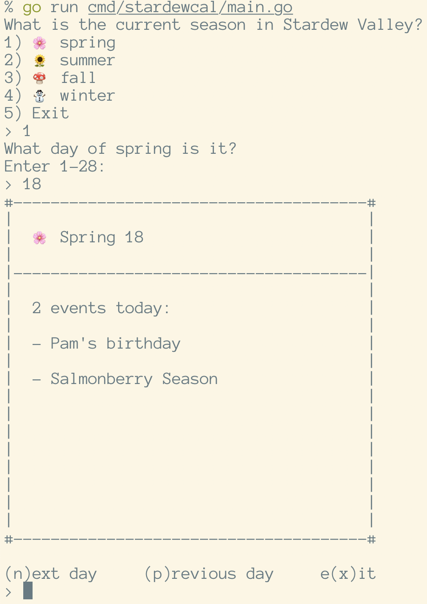

# Go Go Stardew Cal

This is a _work in progress_ tool written in Go to keep track of
things you want to do each day in your Stardew Valley game, such
as whose birthday it is so you can give them a gift, when the
Night Market arrives, when the traveling merchant arrives, etc.



## How to develop

I built this app using Go version 1.13.4.

```sh
go run cmd/stardewcal/main.go
```

It will prompt you for the current season and day in your Stardew Valley
game, then tell you if any birthdays, festivals, or other notable events
are happening that day.
